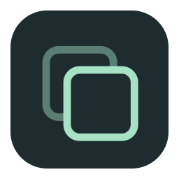
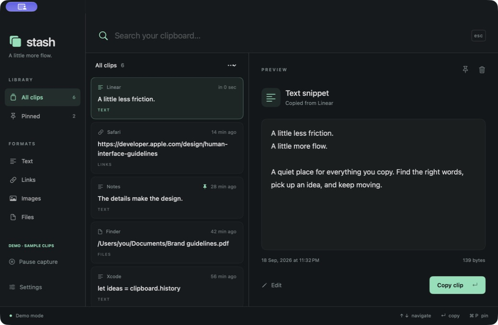
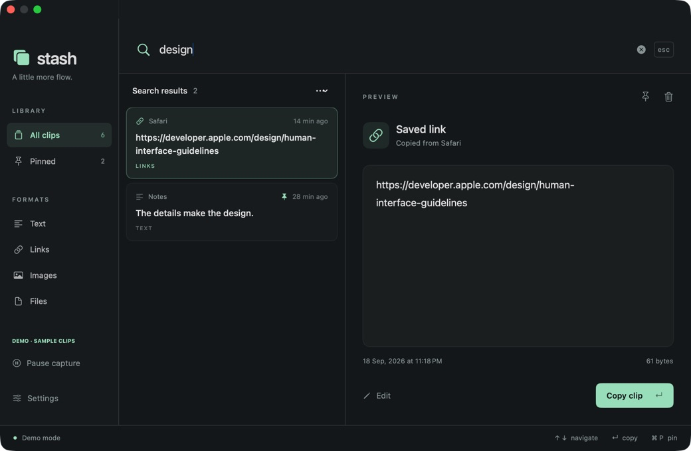

<p align="center">
  
</p>
<h1 align="center">Stash</h1>
<p align="center"><strong>Your clipboard, with a memory.</strong></p>
<p align="center">Copy something. Find it later. Keep moving.</p>
<p align="center">
  <a href="#install-from-source">Install</a> ·
  <a href="docs/USAGE.md">User guide</a> ·
  <a href="https://github.com/MrJomadar3rdgeneration/stash/issues">Report a bug</a>
</p>
<p align="center">
  <a href="https://github.com/MrJomadar3rdgeneration/stash/actions/workflows/ci.yml"></a>
  
  <a href="LICENSE"></a>
</p>

Stash is a native macOS clipboard manager that remembers what you copy and makes it easy to find again. Save a useful link, recover a paragraph, or keep a reply template close at hand—all from a quiet menu-bar app, with your history encrypted on your Mac.



*The real Stash interface, shown with fictional sample clips.*

## A little less searching, a little more flow

| Feature | What it does |
| --- | --- |
| Automatic history | Remembers new copies from the macOS system clipboard while Stash is running. |
| Instant search | Filters your history as you type, with case- and accent-insensitive matching. |
| More than text | Saves plain text, HTML/RTF, links, PNG/TIFF images, and file references. |
| Keyboard access | Opens with a customizable global shortcut; navigate and copy without the mouse. |
| Pins and editing | Keeps favorite snippets through automatic cleanup and lets you edit saved text. |
| Local privacy | Encrypts history with AES-GCM and keeps the encryption key in your login Keychain. |
| Everyday controls | Pause capture, exclude apps, delete individual clips, or clear history. |
| Ready after login | Starts quietly when you sign into your Mac, if you enable Launch at login. |

## Install from source

Prebuilt downloads are temporarily unavailable while Developer ID signing and Apple notarization are being configured. Building locally avoids the unidentified-developer warning because the app is created on your own Mac.

You need **macOS 14 or later** and **Swift 6 or later**, provided by Xcode 16+ or compatible Apple Command Line Tools. Install the tools with `xcode-select --install` if needed, then run:

```sh
git clone https://github.com/MrJomadar3rdgeneration/stash.git
cd stash
./scripts/install.sh
```

The installer runs Stash's checks, builds the app for your Mac, verifies the bundle, and copies it to `/Applications/Stash.app`. It never downloads third-party packages. If `/Applications` requires administrator access, macOS asks for your password only for the final copy.

Open Stash from Applications, then enable **Settings → Launch at login** if you want it available after every restart. Keep the cloned folder when you want to build an update later.

## From copy to found in seconds

1. **Copy as usual.** Stash saves new clipboard content while it runs in the menu bar.
2. **Open with ⌘⇧V.** Type a word, or choose a format from the sidebar.
3. **Press Return to copy.** Switch to your destination app and press **⌘V**.


*Search across text, links, file paths, source-app names, and format labels. Images do not have OCR search.*

Pin the snippets you use often. Edit a saved text or link clip without pasting and copying it again; edits are saved as plain text. The whole sidebar row is clickable, so switching between **All clips**, **Pinned**, and format filters feels natural.

Prefer fewer steps? Enable **Paste directly into the previous app** in Settings and grant Accessibility access. Stash can then send ⌘V after restoring a clip. Basic capture, search, and copying do not need Accessibility. Some apps or protected fields may require manual paste.

### Keyboard shortcuts

| Shortcut | Action |
| --- | --- |
| **⌘⇧V** | Open or hide history; customizable in Settings |
| **↑ / ↓** | Select a result |
| **Return** | Copy the selected clip, or paste if direct paste is enabled |
| **⇧Return** | Use the plain-text representation |
| **⌘P** | Pin or unpin the selected clip |
| **⌘⌫** | Delete the selected clip |
| **Escape** | Hide history |
| **⌘,** | Open Settings |
| **⌘Q** | Quit Stash |

History actions apply while the history window is focused, outside Settings or the editor. Closing the red window button leaves capture running; **Quit Stash** stops it.

See the **[user guide](docs/USAGE.md)** for shortcut customization, direct paste, app exclusions, retention settings, and troubleshooting.

## Your history stays on your Mac

Stash has no network client or cloud sync. Saved clips and metadata are encrypted in `~/Library/Application Support/Stash/`; the key stays in your login Keychain. Preferences use the `com.stash.clipboard` domain.

The app skips content marked confidential or transient and copies from excluded foreground apps. Several password managers are excluded by default.

By default, Stash keeps **1,000 clips for 30 days**, with a **250 MB payload budget** for automatic cleanup. Pins are exempt. Individual snapshots over **20 MB** are skipped. File clips retain references to the original files, so moving or deleting those files can affect later pastes.

Encryption protects stored files. Read the [privacy details](docs/USAGE.md#privacy-and-storage) and [security policy](SECURITY.md).

## Designed to stay out of the way

Stash checks for changes every 0.5 seconds, or every second in Low Power Mode. Monitoring pauses during system/display sleep, inactive login sessions, and manual capture pause. It does not keep your Mac awake.

## Updates and removal

To update, quit Stash and return to the cloned repository:

```sh
git pull --ff-only
./scripts/install.sh --replace
```

There is no in-app automatic updater. The installer keeps the previous app in Trash when replacing it. Keep your history and its original Keychain key together; rebuilding the app cannot replace a missing key.

To uninstall, disable **Launch at login**, quit Stash, then move the app to Trash. History remains in Library unless you explicitly clear it. Deletion has no undo, and backups may retain earlier copies.

## Build from source

You need **Swift 6+**, Xcode 16+ or compatible Apple Command Line Tools, and macOS 14+.

```sh
git clone https://github.com/MrJomadar3rdgeneration/stash.git
cd stash
swift run StashChecks
./scripts/build.sh
```

The app is created at `build/Stash.app`, ready to move into Applications. The script builds for your Mac's architecture and signs locally. No third-party package dependencies are downloaded.

The **12 automated checks** cover encryption, tamper rejection, retention, pins, search, and production capture/replay for text, HTML, RTF, links, images, and multiple files. Clipboard checks use isolated named pasteboards and leave your general clipboard untouched. GitHub CI also builds and packages the app.


## Contribute

Bug reports, thoughtful improvements, and compatibility testing are welcome. Start with [CONTRIBUTING.md](CONTRIBUTING.md). Use fictional clipboard content in reports and screenshots; never upload your history or credentials. Report security issues through [private vulnerability reporting](https://github.com/MrJomadar3rdgeneration/stash/security/advisories/new).

[Changelog](CHANGELOG.md)

## License

[MIT](LICENSE) · Copyright © 2026 Stash contributors.
